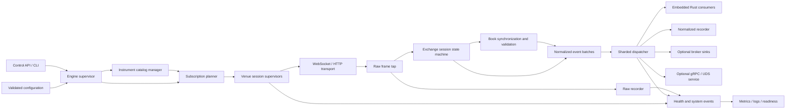

# Production Specification: Rust Multi-Exchange Market Data Engine

**Working name:** `marketfeed`  
**Document status:** Architecture and product specification  
**Version:** 1.0  
**Date:** 2026-07-21  
**Primary target:** Linux x86_64 and Linux aarch64  
**Language:** Rust 2024 edition  
**Initial domain:** Public cryptocurrency market data for spot, perpetual swaps, and dated futures  
**Future-compatible domain:** Options, private account streams, and non-crypto venues without redesigning the core

---

## 1. Purpose

`marketfeed` is a greenfield, Rust-native engine for consuming, validating, normalizing, recording, replaying, and distributing real-time market data from multiple exchanges.

It is not a port of Cryptofeed and does not aim for API compatibility with it. Exchange integrations are implemented from official venue documentation, captured fixtures, and original tests. The architecture, domain model, adapter API, recording format, runtime model, and public API are original.

The engine must serve two primary use cases:

1. **Embedded library:** a Rust application embeds the engine and consumes strongly typed events directly.
2. **Standalone daemon:** a production service runs the same engine and publishes data through configured sinks or streaming APIs.

The project must be usable in low-latency trading infrastructure, while remaining maintainable enough for outside contributors to add and operate exchange adapters safely.

Normative words in this document use their RFC-style meanings:

- **MUST**: required for correctness or production readiness.
- **SHOULD**: strongly recommended; deviations require an explicit architecture decision.
- **MAY**: optional.

---

## 2. Product boundary

### 2.1 Included in version 1

The engine MUST support:

- Instrument discovery and metadata refresh.
- Spot instruments.
- Linear and inverse perpetual swaps.
- Linear and inverse dated futures.
- Public WebSocket market-data streams.
- REST requests required for instrument discovery and order-book snapshots.
- Trades.
- Best bid and offer.
- L2 order-book snapshots and deltas.
- Candles where supplied natively by the venue.
- Mark price.
- Index price.
- Funding rate and next-funding metadata.
- Open interest.
- Liquidations.
- Venue and instrument status events.
- Raw frame recording.
- Normalized event recording.
- Deterministic replay.
- Dynamic subscription changes.
- Multiple independent sinks.
- Embedded Rust consumption.
- A standalone daemon, CLI, health endpoint, readiness endpoint, and metrics endpoint.

### 2.2 Deferred but architecturally supported

The following are not required for the first production release, but the model MUST not prevent their later addition:

- L3/order-by-order books.
- Options and option Greeks.
- Authenticated account streams.
- Order entry and execution.
- Blockchain node or DEX event ingestion.
- FIX, SBE, or proprietary binary venue protocols.
- Language bindings.
- Distributed coordination between multiple engine instances.

### 2.3 Explicit non-goals

Version 1 MUST NOT include:

- Strategy execution.
- Portfolio accounting.
- Position management.
- Risk management.
- Smart order routing.
- Backtesting beyond deterministic market-data replay.
- A mandatory Kafka, NATS, Redis, or database dependency.
- A plugin ABI for loading arbitrary dynamic libraries at runtime.
- A global total ordering across independent exchanges.

This boundary keeps the project focused on market-data correctness and operational reliability.

---

## 3. Success criteria

A release may be described as production-ready only when all of the following are true:

1. At least three exchange families are implemented, including both spot and derivatives.
2. At least two adapters have reached the project’s `stable` maturity level.
3. L2 order books pass deterministic sequence, gap, checksum, snapshot, and replay tests.
4. Every queue, buffer, cache, and recording segment has an explicit bound.
5. There are no silent data drops.
6. Every reconnect, resynchronization, invalidation, queue overflow, and parse failure produces a metric and structured diagnostic event.
7. The engine completes a continuous live soak test without unbounded memory growth.
8. The engine survives injected disconnects, malformed messages, snapshot failures, slow sinks, disk-full conditions, and clock jumps according to the policies in this specification.
9. Release artifacts pass dependency, license, vulnerability, API compatibility, and provenance checks.
10. The public Rust API, configuration schema, recording format, and adapter maturity matrix are documented.

---

## 4. Architecture alternatives

### 4.1 Alternative A: single daemon monolith

All adapters, books, sinks, and APIs live in one executable.

**Advantages**

- Fastest initial implementation.
- Simple deployment.
- Minimal public API design.

**Disadvantages**

- Difficult to embed.
- Tests become coupled to process-level behavior.
- Exchange contributors must understand the whole service.
- Internal types tend to leak into transport and sink code.
- Later library extraction is expensive.

### 4.2 Alternative B: library-first engine plus optional daemon — selected

A reusable workspace contains the engine, model, adapter API, transport, books, recording, replay, and sinks. A daemon composes those crates without changing engine semantics.

**Advantages**

- Supports embedded and service deployments.
- Preserves a small, testable core.
- Exchange adapters can be independently developed.
- The daemon is replaceable.
- Native Rust consumers avoid IPC and serialization.
- External consumers can use stable schemas through optional service crates.

**Disadvantages**

- Requires deliberate public API design from the beginning.
- More workspace crates and release discipline.

### 4.3 Alternative C: one microservice per venue

Each venue connector publishes to a mandatory event broker.

**Advantages**

- Independent venue deployment and fault isolation.
- Horizontal scaling.

**Disadvantages**

- Broker and serialization latency become mandatory.
- Distributed operations are required before the core is proven.
- Cross-service schema and deployment compatibility dominate development.
- Embedded use becomes impossible.

### 4.4 Decision

The project SHALL use **Alternative B**.

The engine will be a library. The daemon will be an application built on the same public engine API. Broker sinks remain optional.

---

## 5. Architecture principles

1. **The engine owns I/O.** Adapters do not create sockets, spawn tasks, sleep, log, or select runtimes.
2. **Adapters are deterministic state machines.** Inputs produce actions; the engine executes those actions.
3. **Hot state has one owner.** A connection session owns its protocol state and associated order-book synchronization state. Global mutable maps are avoided.
4. **All queues are bounded.** Backpressure and overflow behavior are explicit.
5. **Correctness outranks availability.** A suspect order book is invalidated and resynchronized rather than emitted as valid.
6. **No global ordering claim.** Ordering is guaranteed only within documented scopes.
7. **Exact arithmetic is canonical.** Prices, quantities, rates, and contract values do not use `f64` as their source of truth.
8. **Raw data is recoverable.** Recording occurs before normalization when enabled.
9. **Replay uses the same adapters.** Live and replay paths must share protocol parsing and state transitions.
10. **The public model is independent of exchange payloads.**
11. **Venue-specific information is preserved without polluting every normalized event.**
12. **Unsafe code is isolated.** Project-owned crates forbid unsafe code unless a narrowly scoped performance crate is approved through an architecture decision.
13. **Operational failure is observable.** No retry loop or data-quality transition is invisible.
14. **Dependencies are replaceable behind narrow boundaries.**
15. **The project remains useful without the daemon.**

---

## 6. System architecture



### 6.1 Control plane

The control plane manages:

- Configuration.
- Instrument catalogs.
- Subscription plans.
- Session lifecycle.
- Dynamic subscription changes.
- Health state.
- Sink lifecycle.
- Graceful shutdown.

Control-plane work MAY allocate and use async trait objects. It is not considered the hot path.

### 6.2 Data plane

The data plane performs:

- Socket reads.
- Immediate receipt timestamping.
- Optional raw recording.
- Decompression.
- Typed parsing.
- Sequence validation.
- Order-book mutation.
- Event construction.
- Bounded dispatch.

The data plane MUST avoid blocking I/O, global locks, synchronous logging, and per-event task creation.

---

## 7. Workspace scaffold

The logical workspace SHALL be organized as follows. Published crate names can be renamed before public release, but boundaries should remain.

```text
marketfeed/
├── Cargo.toml
├── Cargo.lock
├── rust-toolchain.toml
├── rustfmt.toml
├── clippy.toml
├── deny.toml
├── LICENSE-APACHE
├── LICENSE-MIT
├── README.md
├── SECURITY.md
├── CONTRIBUTING.md
├── CODE_OF_CONDUCT.md
├── GOVERNANCE.md
├── CHANGELOG.md
├── docs/
│   ├── architecture/
│   ├── adapters/
│   ├── operations/
│   ├── recording-format/
│   └── rfcs/
├── proto/
│   └── marketfeed/v1/
├── crates/
│   ├── model/
│   ├── adapter-api/
│   ├── adapter-testkit/
│   ├── catalog/
│   ├── subscription/
│   ├── transport/
│   ├── book/
│   ├── engine/
│   ├── recording/
│   ├── replay/
│   ├── dispatch/
│   ├── telemetry/
│   ├── config/
│   ├── service-api/
│   ├── daemon/
│   ├── cli/
│   ├── facade/
│   ├── adapters/
│   │   ├── binance/
│   │   ├── okx/
│   │   ├── bybit/
│   │   ├── kraken/
│   │   └── deribit/
│   └── sinks/
│       ├── channel/
│       ├── file/
│       ├── protobuf/
│       ├── kafka/
│       ├── nats/
│       └── udp/
├── examples/
├── fixtures/
├── benches/
├── fuzz/
├── test-data/
└── .github/
    ├── workflows/
    ├── ISSUE_TEMPLATE/
    └── PULL_REQUEST_TEMPLATE.md
```

### 7.1 Public crate boundary

Initially, only the following SHOULD be published:

- Facade crate.
- Model crate.
- Adapter API.
- Adapter test kit.
- Stable adapter crates.
- Recording and replay crate.

Internal orchestration crates MAY remain unpublished until their APIs are intentionally stabilized.

### 7.2 Feature policy

Features SHOULD be additive and narrowly scoped:

- `adapter-binance`
- `adapter-okx`
- `adapter-bybit`
- `sink-kafka`
- `sink-nats`
- `sink-grpc`
- `parser-simd-json`
- `transport-fastwebsockets`
- `otel`
- `latency-runtime`

Mutually exclusive implementations MUST fail compilation with a clear message rather than silently selecting one.

A public `all` feature SHOULD be avoided for production binaries because it increases build time, binary size, attack surface, and dependency ambiguity. A documentation-only feature set MAY enable all components in CI.

---

## 8. Domain model

### 8.1 Identifier strategy

Hot-path events MUST use compact identifiers rather than repeated venue and symbol strings.

```rust
pub struct VenueId(pub u16);
pub struct InstrumentId(pub u32);
pub struct ConnectionId(pub u64);
pub struct SessionId(pub u64);
pub struct CatalogVersion(pub u64);
```

`InstrumentId` is process-local. Recordings MUST include the catalog snapshot and mapping required to decode IDs later.

A stable external instrument key SHALL consist of structured fields rather than a single inferred string:

```rust
pub struct InstrumentKey {
    pub venue: VenueCode,
    pub native_symbol: CompactString,
    pub kind: InstrumentKind,
    pub settlement: Option<AssetCode>,
    pub expiry_ns: Option<i64>,
}
```

### 8.2 Instrument types

```rust
pub enum InstrumentKind {
    Spot,
    PerpetualLinear,
    PerpetualInverse,
    FutureLinear,
    FutureInverse,
    Option,
}
```

Options are reserved for future use but included to prevent a breaking model redesign.

### 8.3 Instrument metadata

```rust
pub struct Instrument {
    pub id: InstrumentId,
    pub key: InstrumentKey,
    pub base: AssetCode,
    pub quote: AssetCode,
    pub settlement: Option<AssetCode>,
    pub price_scale: u8,
    pub quantity_scale: u8,
    pub price_increment: Fixed,
    pub quantity_increment: Fixed,
    pub min_quantity: Option<Fixed>,
    pub max_quantity: Option<Fixed>,
    pub min_notional: Option<Fixed>,
    pub contract_size: Option<Fixed>,
    pub expiry_ns: Option<i64>,
    pub status: InstrumentStatus,
    pub inverse: bool,
    pub catalog_version: CatalogVersion,
}
```

Venue metadata that cannot yet be normalized MUST be available through a separately versioned metadata extension, not through an untyped map on every market event.

### 8.4 Exact numeric representation

Canonical prices, sizes, rates, and notionals MUST use fixed-point integers.

```rust
pub struct Fixed {
    pub coefficient: i128,
    pub scale: u8,
}

pub struct Price(pub Fixed);
pub struct Quantity(pub Fixed);
pub struct Rate(pub Fixed);
```

Rules:

- Parsing MUST operate directly from decimal bytes where possible.
- Parsing MUST reject overflow.
- Rounding MUST never occur silently.
- Rescaling MUST use an explicit rounding mode.
- Instrument-specific order books SHOULD store price and quantity at catalog-defined scales to reduce repeated scale storage.
- `f64` MAY be exposed as a convenience conversion but MUST never be canonical.
- Scientific notation MUST be accepted only when a venue actually emits it and must be converted exactly when representable.

### 8.5 Timestamps

```rust
pub struct TimestampNs(pub i64);
```

Every normalized event MUST carry:

- `exchange_ts`: optional source timestamp.
- `receive_ts`: local wall-clock timestamp taken immediately after receiving the complete frame.
- `frame_seq`: monotonically increasing within a session.
- `event_index`: index of the event produced from a frame.

The engine SHOULD also record a monotonic timestamp internally for latency measurement and clock-jump detection.

Wall-clock and monotonic time MUST not be conflated.

### 8.6 Event envelope

```rust
pub struct EventEnvelope {
    pub schema_version: u16,
    pub venue: VenueId,
    pub instrument: Option<InstrumentId>,
    pub connection: ConnectionId,
    pub session: SessionId,
    pub frame_seq: u64,
    pub event_index: u16,
    pub exchange_ts: Option<TimestampNs>,
    pub receive_ts: TimestampNs,
    pub source_sequence: Option<SequenceRange>,
    pub flags: EventFlags,
    pub payload: MarketEvent,
}
```

### 8.7 Market events

```rust
pub enum MarketEvent {
    Trade(Trade),
    Quote(Quote),
    BookSnapshot(BookSnapshot),
    BookDelta(BookDelta),
    Candle(Candle),
    MarkPrice(PricePoint),
    IndexPrice(PricePoint),
    Funding(Funding),
    OpenInterest(OpenInterest),
    Liquidation(Liquidation),
    Statistics24h(Statistics24h),
    InstrumentUpdate(InstrumentUpdate),
    VenueStatus(VenueStatus),
}
```

The model MUST avoid a single “ticker” object containing dozens of unrelated optional fields. Semantically distinct data gets distinct event types.

### 8.8 Trade semantics

`Trade.side` MUST mean **aggressor/taker side**. If a venue only provides maker side, the adapter must invert it and document the source behavior.

```rust
pub struct Trade {
    pub price: Price,
    pub quantity: Quantity,
    pub aggressor: AggressorSide,
    pub trade_id: Option<SourceId>,
}
```

### 8.9 Quote semantics

```rust
pub struct Quote {
    pub bid_price: Price,
    pub bid_quantity: Option<Quantity>,
    pub ask_price: Price,
    pub ask_quantity: Option<Quantity>,
}
```

A quote MUST represent a coherent BBO from one venue stream or one validated local book. It MUST NOT synthesize quantities as zero when unavailable.

### 8.10 Book events

```rust
pub struct BookLevel {
    pub price: Price,
    pub quantity: Quantity,
}

pub enum BookSide {
    Bid,
    Ask,
}

pub enum BookOperation {
    Upsert,
    Delete,
}

pub struct BookChange {
    pub side: BookSide,
    pub operation: BookOperation,
    pub price: Price,
    pub quantity: Option<Quantity>,
}

pub struct BookSnapshot {
    pub bids: Vec<BookLevel>,
    pub asks: Vec<BookLevel>,
    pub depth: Option<u32>,
    pub checksum: Option<SourceId>,
}

pub struct BookDelta {
    pub changes: Vec<BookChange>,
    pub checksum: Option<SourceId>,
}
```

Zero quantity from a venue SHALL be normalized to `Delete`. Consumers do not need venue-specific zero-deletion rules.

### 8.11 System events

Operational state is not market data and SHALL use a separate stream:

```rust
pub enum SystemEvent {
    EngineStateChanged,
    ConnectionStateChanged,
    SubscriptionStateChanged,
    InstrumentCatalogUpdated,
    HeartbeatMissed,
    RateLimited,
    ParseError,
    UnknownMessage,
    SequenceGap,
    ChecksumMismatch,
    BookInvalidated,
    BookResynchronized,
    QueuePressure,
    EventsDropped,
    RecordingRotated,
    DiskPressure,
    ClockJump,
    SinkStateChanged,
    ShutdownStarted,
    ShutdownCompleted,
}
```

Every system event MUST be structured and include venue/session context where applicable.

### 8.12 Flags and quality

Events MUST support quality flags:

- `SNAPSHOT`
- `DELTA`
- `REPLAY`
- `RECOVERED`
- `STALE`
- `OUT_OF_ORDER_SOURCE`
- `SOURCE_TIMESTAMP_MISSING`
- `SYNTHETIC`
- `RAW_REFERENCE_AVAILABLE`

A consumer MUST be able to distinguish venue-native events from locally derived events.

---

## 9. Ordering guarantees

The engine SHALL guarantee:

1. Frames from one WebSocket session are processed in read order.
2. Events derived from one frame are ordered by `event_index`.
3. Validated book updates for one instrument are emitted in source sequence order.
4. A book snapshot is emitted before deltas that depend on it.
5. Dynamic subscription plan versions are monotonically increasing.

The engine SHALL NOT guarantee:

- Total order across venues.
- Total order across independent venue connections.
- Causal order between a REST response and an unrelated WebSocket session.
- Event-time order when exchanges provide delayed or non-monotonic timestamps.

Consumers requiring a total order must construct one using `receive_ts`, `session`, `frame_seq`, and their own policy.

---

## 10. Subscription model

### 10.1 Subscription request

```rust
pub struct Subscription {
    pub venue: VenueId,
    pub selector: InstrumentSelector,
    pub channel: Channel,
    pub delivery: DeliveryOptions,
}

pub enum Channel {
    Trades,
    Quote,
    L2Book { depth: Option<u32>, cadence: Option<Duration> },
    L3Book,
    Candles { interval: CandleInterval },
    MarkPrice,
    IndexPrice,
    Funding,
    OpenInterest,
    Liquidations,
    Statistics24h,
    InstrumentStatus,
}
```

### 10.2 Instrument selectors

Selectors MAY identify:

- Exact instrument IDs.
- Exact canonical keys.
- Base/quote pairs.
- Instrument kind.
- Quote currency.
- Settlement currency.
- All active instruments in a venue segment.

Selectors are expanded against a specific catalog version. The resulting concrete subscription set is recorded in the plan.

### 10.3 Subscription planner

The planner MUST account for:

- Venue endpoint.
- Spot versus derivatives segment.
- Authentication mode.
- Maximum streams per connection.
- Maximum symbols per subscription message.
- URL length limits.
- Subscription request rate limits.
- Message-rate concentration.
- Required channel combinations.
- Venue-specific multiplexing rules.
- Sandbox versus production environment.

Planning MUST be deterministic. Given the same catalog and request set, the planner must produce the same sorted session plan.

### 10.4 Dynamic changes

The control API MUST support:

- Add.
- Remove.
- Replace complete set.
- Pause venue.
- Resume venue.

A change returns a `PlanVersion`. Acceptance of the command does not imply that all streams are live. Readiness is announced through subscription state events.

If a venue cannot modify subscriptions in place, the engine SHOULD perform a rolling session replacement:

1. Start replacement session.
2. Confirm subscription.
3. Reach required synchronization state.
4. Switch output ownership.
5. Stop old session.
6. Deduplicate overlap using source IDs or sequence numbers where possible.

---

## 11. Adapter architecture

### 11.1 Design objective

Adding a venue should require exchange protocol work, not reimplementation of:

- Socket management.
- TLS.
- HTTP pooling.
- Retries.
- Timers.
- Rate limiting.
- Backpressure.
- Recording.
- Metrics.
- Task supervision.
- Shutdown.
- Generic order-book storage.
- Sink delivery.

### 11.2 Adapter factory

```rust
pub trait VenueFactory: Send + Sync + 'static {
    fn specification(&self) -> &'static VenueSpecification;

    fn instrument_requests(
        &self,
        environment: Environment,
    ) -> Result<Vec<HttpRequestSpec>, AdapterError>;

    fn parse_instruments(
        &self,
        responses: &[HttpResponse],
        out: &mut Vec<InstrumentDefinition>,
    ) -> Result<(), AdapterError>;

    fn plan(
        &self,
        request: &ConcreteSubscriptionSet,
        catalog: &InstrumentCatalog,
    ) -> Result<Vec<SessionSpec>, AdapterError>;

    fn create_session(
        &self,
        spec: SessionSpec,
        catalog: CatalogView,
    ) -> Result<Box<dyn SessionMachine>, AdapterError>;
}
```

### 11.3 Session state machine

```rust
pub trait SessionMachine: Send + 'static {
    fn on_input(
        &mut self,
        input: SessionInput<'_>,
        output: &mut ActionBuffer,
    ) -> Result<(), AdapterError>;
}
```

Inputs:

```rust
pub enum SessionInput<'a> {
    Connected { now: TimestampNs },
    Disconnected { reason: DisconnectReason, now: TimestampNs },
    TextFrame { bytes: &'a mut [u8], received: FrameStamp },
    BinaryFrame { bytes: &'a mut [u8], received: FrameStamp },
    Pong { payload: &'a [u8], received: FrameStamp },
    HttpResponse { request_id: u64, response: &'a HttpResponse },
    Timer { timer_id: u64, now: TimestampNs },
    Control { command: &'a SessionCommand },
}
```

Actions:

```rust
pub enum SessionAction {
    SendText(Bytes),
    SendBinary(Bytes),
    SendPing(Bytes),
    RequestHttp(HttpRequestSpec),
    ScheduleTimer(TimerSpec),
    CancelTimer(u64),
    EmitBatch(EventBatch),
    EmitSystem(SystemEvent),
    MarkLive,
    MarkDegraded,
    ResyncInstrument(InstrumentId),
    Reconnect(ReconnectReason),
    DisableSubscription(SubscriptionId),
    StopSession(StopReason),
}
```

### 11.4 Adapter restrictions

Adapters MUST NOT:

- Open network connections.
- Call `tokio::spawn`.
- Sleep.
- access global mutable state.
- install logging subscribers.
- write to disk.
- publish to sinks.
- use unbounded collections for buffered deltas.
- panic on malformed remote input.
- convert exact numbers through `f64`.

Adapters SHOULD:

- Parse directly into typed borrowed structures.
- Reuse buffers.
- Return structured errors.
- Use shared helpers for decimal parsing, timestamps, signatures, decompression, channel mapping, and book synchronization.
- Preserve unknown message samples in diagnostics subject to payload-size and secret-redaction policy.

### 11.5 Venue specification

```rust
pub struct VenueSpecification {
    pub id: VenueId,
    pub code: &'static str,
    pub environments: &'static [Environment],
    pub segments: &'static [MarketSegment],
    pub capabilities: &'static [Capability],
    pub endpoints: &'static [EndpointSpec],
    pub subscription_constraints: SubscriptionConstraints,
    pub heartbeat_policy: HeartbeatPolicy,
    pub reconnect_policy: ReconnectPolicy,
    pub max_frame_bytes: usize,
    pub max_decompressed_bytes: usize,
}
```

### 11.6 Adapter directory template

```text
crates/adapters/<venue>/
├── Cargo.toml
├── README.md
├── src/
│   ├── lib.rs
│   ├── specification.rs
│   ├── instruments.rs
│   ├── planner.rs
│   ├── session.rs
│   ├── messages.rs
│   ├── channels.rs
│   ├── timestamps.rs
│   ├── book.rs
│   └── error.rs
└── tests/
    ├── instruments.rs
    ├── subscriptions.rs
    ├── messages.rs
    ├── book_sync.rs
    ├── reconnect.rs
    └── fixtures/
```

### 11.7 Adapter test kit

The test kit MUST provide reusable assertions for:

- Instrument normalization.
- Decimal exactness.
- Subscription batching.
- Subscription acknowledgement.
- Unknown message handling.
- Trade side semantics.
- Timestamp normalization.
- Book snapshot and delta behavior.
- Sequence gaps.
- Duplicate deltas.
- Out-of-order deltas.
- Checksum failures.
- Buffer overflow.
- Reconnect action.
- Deterministic output.
- Serialization round trips.

### 11.8 Adapter maturity levels

**Experimental**

- Compiles.
- Unit tests and fixtures exist.
- No production recommendation.

**Beta**

- Instrument discovery works.
- Primary public channels work.
- Replay corpus and live canary exist.
- Known limitations are documented.
- No unresolved known book-corruption issue.

**Stable**

- Complete capability matrix.
- Sequence and checksum rules documented.
- Scheduled live canaries cover all stable channels.
- Long-running soak tests pass.
- Operational dashboards and runbook exist.
- No high-severity correctness defect is open.
- Backward compatibility is maintained for the adapter’s public configuration.

---

## 12. Session runtime and supervision

### 12.1 Session lifecycle

```text
Planned
  -> Connecting
  -> Connected
  -> Authenticating (optional)
  -> Subscribing
  -> Synchronizing
  -> Live
  -> Degraded
  -> Backoff
  -> Connecting

Any state
  -> Draining
  -> Stopped
```

Every state transition MUST emit a system event and update metrics.

### 12.2 Supervision hierarchy

```text
EngineSupervisor
├── CatalogManager
├── DispatcherSupervisors
├── SinkSupervisors
└── VenueSupervisor[venue]
    ├── RestScheduler
    └── SessionSupervisor[connection]
        └── SessionRunner
```

A session task panic or unexpected exit MUST be observed by its supervisor. Detached tasks are forbidden in engine-owned code.

### 12.3 Cancellation and shutdown

The implementation SHOULD use hierarchical cancellation tokens:

- Engine token.
- Venue child token.
- Session child token.
- Sink child token.

Graceful shutdown sequence:

1. Reject new control mutations.
2. Mark readiness false.
3. Cancel session reads.
4. Stop accepting newly produced events.
5. Drain internal event queues within a configured deadline.
6. Flush lossless sink WALs and recording segments.
7. Persist final indexes and checksums.
8. Emit shutdown completion.
9. Terminate remaining tasks after the deadline.

### 12.4 Reconnect policy

Default reconnect policy:

- Exponential backoff.
- Full jitter.
- Configurable minimum and maximum delay.
- Retry counter reset after a stable-live interval.
- Endpoint failover where configured.
- Circuit breaker after repeated protocol or authentication failures.
- No insecure TLS fallback.
- No infinite tight retry loop.

Rate-limit responses and server-provided retry intervals override the generic minimum delay.

### 12.5 Heartbeats and liveness

The engine MUST distinguish:

- Transport ping/pong.
- Venue application heartbeat.
- Subscription acknowledgement.
- Last received frame.
- Last valid market event.
- Last valid sequence.

Illiquid trade channels must not be considered dead merely because no trades occur. Liveness policies are venue/channel-specific.

---

## 13. Runtime profiles

### 13.1 Portable profile — default

- Tokio multithreaded runtime.
- Session tasks may migrate between worker threads.
- One synchronous parse/state-machine call per received frame.
- Bounded Tokio channels for async boundaries.
- No CPU affinity requirement.
- Supported on Linux, macOS, and Windows.

### 13.2 Latency profile — optional

- Linux only.
- Multiple current-thread runtimes pinned to selected CPU cores.
- Connections are deterministically assigned to runtime shards.
- A separate control runtime handles catalog, configuration, and service APIs.
- Cross-shard communication uses bounded channels.
- IRQ, NIC queue, NUMA, and CPU-governor tuning are documented but not performed silently by the process.
- Public portable binaries do not enable `target-cpu=native`; operators MAY build a host-specific binary.

The latency profile MUST produce identical normalized results to the portable profile.

### 13.3 Task rules

The data plane MUST NOT:

- Spawn one task per frame or event.
- Use `spawn_blocking` for JSON parsing.
- Perform DNS, file I/O, or compression inline.
- Hold an async mutex across parsing or event construction.
- log every message.
- allocate a new HTTP client for each request.

---

## 14. Transport subsystem

### 14.1 Abstraction

```rust
pub trait WebSocketTransport: Send {
    async fn connect(&mut self, spec: &WebSocketSpec) -> Result<(), TransportError>;
    async fn read_frame(&mut self, buffer: &mut FrameBuffer) -> Result<Frame, TransportError>;
    async fn write_frame(&mut self, frame: OutboundFrame) -> Result<(), TransportError>;
    async fn close(&mut self, reason: CloseReason) -> Result<(), TransportError>;
}
```

The public engine API MUST not expose the concrete WebSocket library.

### 14.2 Baseline implementation

The initial production implementation SHOULD use a mature Tokio WebSocket stack with Rustls-backed TLS. An alternative fast WebSocket implementation MAY be offered behind a feature after the benchmark and conformance gates below.

Transport replacement requirements:

- Pass an RFC 6455 conformance suite.
- Pass all exchange replay and live tests.
- Show a meaningful measured improvement on representative market frames.
- Not weaken TLS or frame-size protections.
- Preserve close, ping, pong, fragmentation, and binary-frame behavior.

### 14.3 TLS

- Certificate validation is mandatory.
- Hostname verification is mandatory.
- TLS 1.2 and 1.3 support is sufficient.
- Insecure certificate modes MUST not be available in normal release builds.
- Root-store selection is explicit.
- TLS errors are structured.
- Session resumption MAY be enabled.
- Secrets and headers are redacted from diagnostics.

### 14.4 WebSocket settings

Defaults SHOULD include:

- `TCP_NODELAY = true`.
- Explicit maximum frame size.
- Explicit maximum message size.
- Explicit maximum decompressed size.
- Bounded internal WebSocket queueing.
- Per-message compression disabled unless required or benchmarked.
- Automatic pong only when compatible with venue protocol.
- Configurable TCP keepalive.
- Configurable socket receive buffer.

### 14.5 REST subsystem

A shared asynchronous HTTP client is created per engine or per venue policy, not per request.

REST scheduling MUST support:

- Venue-level and route-level rate limits.
- Weighted requests.
- Priority classes.
- `Retry-After`.
- Server rate-limit headers.
- Timeouts.
- Bounded response bodies.
- Snapshot requests prioritized above periodic metadata refresh.
- Cancellation when the requesting session no longer exists.
- Correlation IDs returned to the session machine.

Priority order:

1. Book recovery snapshots.
2. Required authentication or listen-key maintenance.
3. Subscription prerequisites.
4. Instrument discovery.
5. Optional polling.

---

## 15. Parsing and frame processing

### 15.1 Frame pipeline

For each complete frame:

1. Capture `receive_ts` and monotonic timestamp.
2. Increment `frame_seq`.
3. Enforce frame-size limits.
4. Offer frame to raw recorder if enabled.
5. Decompress with an output-size bound when required.
6. Pass exclusive mutable bytes to the adapter session machine.
7. Parse directly into typed structures.
8. Apply protocol and book-state transitions.
9. Produce one preallocated `EventBatch`.
10. Submit the batch to the internal dispatcher.
11. Update latency metrics using sampling.

### 15.2 JSON policy

- Typed deserialization is preferred over generic DOM parsing.
- The correctness baseline uses Serde-compatible parsing.
- SIMD JSON parsing MAY be enabled in release binaries after corpus parity tests.
- SIMD and non-SIMD parsers MUST produce identical normalized events.
- Inputs requiring mutation must be exclusively owned by the parsing step.
- Duplicate JSON-key behavior must be deliberate and tested.
- Very large integers must not silently convert to floating point.

### 15.3 Allocation policy

The steady-state hot path SHOULD:

- Reuse receive buffers.
- Reuse decompression buffers.
- Reuse action and event batches.
- Intern venue and instrument identifiers.
- Avoid cloning raw payloads.
- Avoid formatting strings.
- Avoid heap allocation for common one-event frames where practical.

“Zero allocation” is not a release claim unless demonstrated for a named path by benchmark and allocator instrumentation.

---

## 16. Order-book subsystem

### 16.1 Modes

```rust
pub enum BookMode {
    Disabled,
    RawDeltas,
    ValidatedDeltas,
    Maintain { depth: Option<u32> },
}
```

`Maintain` keeps local state and may emit snapshots, deltas, BBO changes, or configured combinations.

### 16.2 Synchronization state

```text
Idle
  -> BufferingDeltas
  -> SnapshotRequested
  -> SnapshotReceived
  -> ApplyingBufferedDeltas
  -> Live
  -> GapDetected
  -> Invalid
  -> Resynchronizing
  -> Live
```

### 16.3 Required behavior

Each venue adapter MUST define:

- Snapshot source.
- Whether deltas may arrive before the snapshot.
- First valid delta rule.
- Sequence range semantics.
- Duplicate rule.
- Out-of-order rule.
- Gap rule.
- Checksum algorithm and canonicalization.
- Resubscription requirements.
- Buffering limits.
- Whether a snapshot and stream must come from the same endpoint or session.
- Whether sequence state is per instrument or per connection.

### 16.4 Delta buffering

Buffers MUST be bounded by all of:

- Message count.
- Byte count.
- Time span.

An overflow invalidates the synchronization attempt. The engine must not discard an arbitrary middle subset and continue.

### 16.5 Atomic validity

A book SHALL be either:

- Valid and queryable.
- Synchronizing.
- Invalid.

A partially applied replacement snapshot must never be visible as valid.

On resynchronization, build a replacement state and atomically transfer output ownership after validation.

### 16.6 Storage

The first implementation SHOULD use safe standard-library ordered structures with cached BBO and depth trimming. The concrete data structure is internal.

A replacement data structure requires:

- Differential equality against the baseline.
- Property tests.
- Fuzz tests.
- Memory benchmarks.
- Representative update benchmarks.
- No public API change.

### 16.7 Invariants

For every valid L2 book:

- Quantities are positive.
- Delete removes the level.
- Bid ordering is descending.
- Ask ordering is ascending.
- Best bid is below best ask unless the venue explicitly documents an auction state represented by a status event.
- Source sequence is continuous according to venue rules.
- Checksum matches when supplied.
- Trimming never changes the correctness of retained levels.
- Snapshot and delta scales match catalog scales.

### 16.8 Query API

Embedded consumers MAY request a current snapshot through an asynchronous command to the owning shard.

The engine MUST NOT expose `Arc<RwLock<OrderBook>>` as its primary API. This would leak synchronization policy and permit readers to block writers.

---

## 17. Internal dispatch and backpressure

### 17.1 Event batches

One frame produces one `EventBatch` where practical.

```rust
pub struct EventBatch {
    pub session: SessionId,
    pub frame_seq: u64,
    pub events: SmallVec<[EventEnvelope; 4]>,
}
```

The dispatcher SHOULD pass batches using cheap shared ownership rather than cloning every event per sink.

### 17.2 Dispatcher sharding

The engine SHOULD use multiple dispatcher shards.

Ordering rules:

- A session is assigned to one dispatcher shard.
- All events from that session retain order.
- A sink may consume from multiple shards.
- Cross-shard total order is not defined.

### 17.3 Source-to-dispatch pressure

The source-to-dispatch channel is bounded.

Allowed policies:

- `Wait`: await capacity while tracking stall duration.
- `ReconnectAfterTimeout`: wait up to a bound, then reconnect and resynchronize.
- `DropBestEffort`: allowed only for channels explicitly configured as lossy.

Book deltas MUST NOT be silently dropped.

If a source stalls long enough that transport buffers or venue timeouts threaten correctness, the session must reconnect rather than continue from an uncertain state.

### 17.4 Sink isolation

A slow sink MUST NOT indefinitely stall unrelated sinks or all source sessions.

Every sink has:

- Bounded in-memory queue.
- Overflow policy.
- Optional disk WAL.
- Health state.
- Metrics.
- Shutdown deadline.

### 17.5 Sink policies

```rust
pub enum OverflowPolicy {
    BlockWithDeadline,
    DropNewest,
    DropOldest,
    LatestPerKey,
    SpillToDisk,
    DisableSink,
    FailEngine,
}
```

Policy restrictions:

- Lossless claims require `SpillToDisk` or `BlockWithDeadline`.
- Disk is finite; a lossless sink must define what happens when the WAL limit is reached.
- `LatestPerKey` is appropriate for BBO/state views, not trades or book deltas.
- Any drop increments counters and emits a rate-limited system event.

### 17.6 No absolute lossless claim

No finite system can guarantee unlimited lossless operation while an upstream source continues and every downstream is unavailable.

Documentation must state:

> Lossless delivery is guaranteed only within configured memory, disk, and shutdown bounds. Exhaustion invokes the configured fail-closed or degradation policy.

---

## 18. Recording format

### 18.1 Raw recording objective

Raw recordings make adapter behavior reproducible and allow historical protocol bugs to become permanent regression fixtures.

### 18.2 Segment structure

Each raw segment SHALL contain:

1. File magic.
2. Format version.
3. Engine build metadata.
4. Start timestamp.
5. Catalog snapshot or reference.
6. Session metadata table.
7. Framed records.
8. Optional index blocks.
9. Footer and checksum.

### 18.3 Raw record

```rust
pub struct RawRecordHeader {
    pub record_len: u32,
    pub session: SessionId,
    pub frame_seq: u64,
    pub receive_ts_ns: i64,
    pub monotonic_ns: u64,
    pub direction: Direction,
    pub opcode: FrameOpcode,
    pub flags: RawFlags,
    pub payload_len: u32,
    pub payload_crc32c: u32,
}
```

The payload follows the header.

### 18.4 Recording requirements

- Segmented files.
- Configurable size and time rotation.
- Crash recovery by scanning and truncating an incomplete tail.
- CRC validation.
- Optional background compression.
- Bounded writer queue.
- Disk-space thresholds.
- Separate policy for public and authenticated streams.
- Secret redaction before persistence.
- No API keys, authorization headers, signatures, or private account payloads in default recordings.
- Metadata sufficient to reproduce endpoint, environment, and subscription plan.

### 18.5 Normalized recording

Normalized events SHALL use a separately versioned schema.

Recommended formats:

- Length-delimited Protobuf for interoperable event logs.
- Arrow IPC or Parquet as an optional batch analytics sink.
- JSONL only for debugging and small fixtures.

### 18.6 Replay

Replay modes:

- As fast as possible.
- Original wall-clock pace.
- Scaled pace.
- Step one frame.
- Step one event.
- Time-window selection.
- Session selection.
- Venue/instrument/channel filter.

Replay MUST support:

- Original timestamps.
- Rebased timestamps.
- Deterministic adapter execution.
- Fault injection: disconnect, frame loss, duplication, reordering, HTTP failure, latency, and corruption.
- Replaying raw frames through the same `SessionMachine` implementation used live.

---

## 19. Public Rust API

### 19.1 Embedded use

Illustrative target API:

```rust
use marketfeed::{
    Engine, EngineConfig, Subscription, Channel, InstrumentSelector,
    sinks::channel::ChannelSink,
};

#[tokio::main]
async fn main() -> anyhow::Result<()> {
    let (sink, mut events) = ChannelSink::bounded(16_384);

    let engine = Engine::builder(EngineConfig::default())
        .register_adapter(marketfeed_binance::Binance::new())
        .subscribe(Subscription::new(
            "binance",
            InstrumentSelector::exact("BTC-USDT", "spot"),
            Channel::Trades,
        ))
        .subscribe(Subscription::new(
            "binance",
            InstrumentSelector::exact("BTC-USDT", "spot"),
            Channel::L2Book { depth: Some(100), cadence: None },
        ))
        .sink(sink)
        .build()
        .await?;

    let handle = engine.start().await?;

    while let Some(batch) = events.recv().await {
        for event in batch.events {
            process(event)?;
        }
    }

    handle.shutdown().await?;
    Ok(())
}
```

The final API may differ syntactically, but MUST preserve:

- Builder-time validation.
- Explicit sinks.
- Explicit bounded capacity.
- Start handle.
- Dynamic control handle.
- Graceful shutdown.
- Separate market and system streams.

### 19.2 Control handle

```rust
pub trait EngineControl {
    async fn apply_subscriptions(
        &self,
        patch: SubscriptionPatch,
    ) -> Result<PlanVersion, ControlError>;

    async fn health(&self) -> Result<HealthSnapshot, ControlError>;

    async fn book_snapshot(
        &self,
        instrument: InstrumentId,
        depth: Option<u32>,
    ) -> Result<BookSnapshot, ControlError>;

    async fn rotate_recordings(&self) -> Result<(), ControlError>;

    async fn shutdown(&self) -> Result<(), ControlError>;
}
```

Commands MUST be idempotent when supplied with a request ID.

### 19.3 API stability

Before version `1.0`, public APIs may change according to documented release notes.

At `1.0`:

- SemVer applies.
- Public feature removal is breaking.
- Event semantic changes are breaking even if Rust types remain source-compatible.
- Recording-format compatibility is governed independently.
- Protobuf field numbers are never reused.
- Adapter configuration changes follow SemVer.

---

## 20. Standalone daemon

### 20.1 CLI commands

```text
marketfeed validate --config <path>
marketfeed catalog --config <path> --venue <venue>
marketfeed plan --config <path>
marketfeed run --config <path>
marketfeed replay --input <segment> [options]
marketfeed inspect-recording --input <segment>
marketfeed benchmark --fixture <path>
marketfeed version
```

### 20.2 Service endpoints

The daemon SHOULD expose:

- `/live`: process is running and supervisor loop is alive.
- `/ready`: configured readiness policy is satisfied.
- `/metrics`: Prometheus-compatible metrics.
- Optional authenticated control API.
- Optional gRPC streaming API.
- Optional Unix-domain-socket stream.

The control API binds to loopback by default. Remote exposure requires explicit authentication and TLS configuration.

### 20.3 Readiness policy

Readiness is configurable:

- All required sessions live.
- Required venues live.
- Required books synchronized.
- Minimum percentage of subscriptions live.
- Recording healthy when required.
- Required sinks healthy.
- Disk above minimum free-space threshold.

A venue outage should not necessarily make the whole process unready unless that venue is declared required.

---

## 21. Configuration

### 21.1 Format

TOML is the primary daemon configuration format. Environment variables may override scalar values. Secrets are resolved from environment or secret-provider integrations, not committed files.

### 21.2 Example

```toml
[engine]
runtime_profile = "portable"
dispatcher_shards = 4
shutdown_deadline = "20s"
max_event_batch = 256

[telemetry]
log_format = "json"
log_level = "info"
metrics_bind = "127.0.0.1:9108"
sample_event_latency = 0.01

[recording.raw]
enabled = true
directory = "/var/lib/marketfeed/raw"
segment_size = "1GiB"
segment_duration = "15m"
compression = "zstd"
queue_capacity = 8192
# Current daemon rejects block_with_deadline until it has a non-spinning owner.
overflow = "fail_engine"
min_free_space = "20GiB"

[[venues]]
id = "binance-spot"
adapter = "binance"
environment = "production"
required = true

[[venues.subscriptions]]
selector = { quote = "USDT", kind = "spot" }
channels = ["trades", "quote", { l2_book = { depth = 100 } }]

[[venues]]
id = "binance-usdm"
adapter = "binance"
segment = "usdm"
environment = "production"
required = true

[[venues.subscriptions]]
selector = { symbols = ["BTC-USDT-PERP", "ETH-USDT-PERP"] }
channels = ["trades", "quote", "funding", "open_interest", "liquidations"]

[[sinks]]
id = "local-events"
type = "protobuf-file"
directory = "/var/lib/marketfeed/events"
queue_capacity = 16384
overflow = "spill_to_disk"
wal_limit = "100GiB"
```

### 21.3 Validation

`validate` MUST catch:

- Unknown venue or channel.
- Unsupported venue/channel combination.
- Invalid instrument selector.
- Zero or excessive queue sizes.
- Conflicting features.
- Invalid overflow policy.
- Missing directories or permissions when testable.
- Insecure remote control binding.
- Impossible readiness policy.
- Invalid duration and byte-size values.
- Unsupported runtime profile on the current OS.
- Missing required secret references.

### 21.4 Hot reload

Hot reload MAY change:

- Subscription sets.
- Log filter.
- Sink enablement.
- Some queue thresholds when safe.
- Readiness policy.

Hot reload MUST NOT change in place:

- Runtime profile.
- TLS provider.
- Recording format version.
- Process-wide allocator.
- Published event schema.

Those changes require restart.

---

## 22. Error model

### 22.1 Categories

```rust
pub enum ErrorCategory {
    Configuration,
    InstrumentCatalog,
    UnsupportedCapability,
    Dns,
    Transport,
    Tls,
    Http,
    RateLimit,
    Authentication,
    Subscription,
    Protocol,
    Parse,
    Decompression,
    SequenceGap,
    ChecksumMismatch,
    BookInvariant,
    Backpressure,
    Recording,
    Disk,
    Sink,
    Serialization,
    Clock,
    InternalInvariant,
    Shutdown,
}
```

### 22.2 Recovery action

Every operational error maps to one action:

```rust
pub enum RecoveryAction {
    IgnoreMessage,
    DropBestEffortEvent,
    InvalidateInstrument,
    ResyncInstrument,
    ReconnectSession,
    DisableSubscription,
    OpenCircuitForVenue,
    DisableSink,
    MarkNotReady,
    StopEngine,
}
```

Adapters return errors and recommended scope; the supervisor owns the final policy.

### 22.3 Error rules

- Malformed trade message: drop message, count, retain session unless repeated.
- Malformed book delta: invalidate affected book and resynchronize.
- Unknown non-data message: record rate-limited diagnostic, continue.
- Sequence gap: invalidate and resynchronize.
- Checksum mismatch: invalidate and resynchronize.
- TLS verification failure: reconnect with backoff; never disable verification.
- Disk full for required lossless recording: readiness false, apply configured fail policy.
- Optional sink failure: isolate sink.
- Repeated session panic: venue circuit breaker and readiness degradation.
- Catalog refresh failure: retain last known good catalog, mark stale, retry.
- Clock jump: emit event; continue using monotonic durations.

---

## 23. Observability

### 23.1 Structured diagnostics

Libraries emit structured `tracing` events but never install a global subscriber. The daemon installs the subscriber.

Required fields include:

- Venue.
- Segment.
- Connection.
- Session.
- Endpoint.
- Subscription plan version.
- Instrument where applicable.
- Error category.
- Recovery action.
- Retry count.
- Queue occupancy.
- Frame sequence.

Raw payload logging is disabled by default and subject to strict truncation and redaction.

### 23.2 Metrics

Required counters:

- Frames received/sent.
- Bytes received/sent.
- Events normalized.
- Events dispatched.
- Parse failures by message type.
- Unknown messages.
- Reconnects by reason.
- Subscription failures.
- Sequence gaps.
- Checksum mismatches.
- Book invalidations/resynchronizations.
- Queue overflows.
- Dropped events by policy.
- Raw records written/dropped.
- Sink writes/failures/retries.
- REST requests/statuses/rate limits.
- Session panics.

Required gauges:

- Session state.
- Live subscriptions.
- Valid books.
- Queue occupancy and capacity.
- Buffered book deltas.
- WAL bytes.
- Recording disk free space.
- Last frame age.
- Last valid event age.
- Catalog age.
- Circuit-breaker state.
- RSS and process file descriptors where available.

Required histograms:

- Frame size.
- Parse duration.
- Normalize duration.
- Book-apply duration.
- Ingress-to-dispatch latency.
- Sink queue delay.
- REST latency.
- Reconnect duration.
- Book resynchronization duration.

High-cardinality labels such as native symbol MUST be opt-in. Default production metrics use venue, segment, channel, and bounded status labels.

### 23.3 OpenTelemetry

OpenTelemetry export is optional. The baseline is structured logs and Prometheus-compatible metrics. OTel-specific dependencies are feature-gated so the core remains stable even while the Rust OTel ecosystem evolves.

### 23.4 Runbooks

Operations documentation MUST include:

- Venue connection flapping.
- Persistent sequence gaps.
- Checksum mismatch storm.
- Rate-limit exhaustion.
- Catalog staleness.
- Sink backlog.
- WAL exhaustion.
- Disk pressure.
- Clock jump.
- Memory growth.
- Graceful and forced shutdown.
- Adapter rollback.

---

## 24. Performance and capacity requirements

These are engineering acceptance budgets, not public benchmark claims until reproduced.

### 24.1 Reference environment

Performance tests SHALL record:

- CPU model.
- Core count.
- Memory.
- Kernel and OS.
- Rust version.
- Build flags.
- Runtime profile.
- Parser backend.
- Allocator.
- Enabled sinks.
- Recording mode.

### 24.2 Required properties

- No unbounded memory growth.
- No unbounded queue.
- No per-event task spawn.
- No global mutex on the frame-to-dispatch path.
- CPU use remains below 70% on the selected production host at the measured expected peak.
- The configured system sustains at least 2× the measured expected peak for a 30-minute replay without drops.
- At expected peak, ingress-to-internal-dispatch latency target:
  - p50 <= 50 microseconds.
  - p99 <= 250 microseconds.
  - p99.9 <= 1 millisecond.
- Latency is measured from complete-frame receipt timestamp to successful internal-dispatch enqueue and excludes network transit.
- A performance regression greater than 10% in a stable benchmark requires explicit approval.
- Memory usage is proportional to configured book depth, active instruments, queue capacities, and recording buffers.

### 24.3 Benchmark suites

Microbenchmarks:

- Fixed decimal parsing.
- Timestamp parsing.
- Trade parsing.
- Quote parsing.
- Book delta parsing.
- Book level upsert/delete.
- Checksum calculation.
- Event serialization.
- Raw record framing.

Pipeline benchmarks:

- One venue, one connection, trades.
- One venue, many symbols, L2.
- Mixed trades and books.
- Multiple venues.
- Recording enabled.
- Slow optional sink.
- Lossless WAL sink.
- Portable versus latency runtime.
- Standard versus SIMD JSON parser.
- WebSocket transport implementations.

### 24.4 Optimization gates

The project SHALL not adopt a custom allocator, unsafe collection, custom WebSocket stack, PGO, BOLT, or CPU-specific build by default without:

1. Reproducible benchmark evidence.
2. Correctness parity.
3. Operational cost analysis.
4. Rollback path.
5. Documentation.

---

## 25. Reliability and data-quality requirements

### 25.1 No silent corruption

The engine MUST prefer:

- Invalid + resynchronizing

over:

- Live + uncertain

for books and sequence-dependent channels.

### 25.2 Staleness

Health tracks:

- Transport liveness.
- Subscription acknowledgement.
- Data freshness.
- Book validity.
- Catalog freshness.

A channel may be live but data-stale. These states must be represented separately.

### 25.3 Deduplication

Deduplication is adapter-specific and only enabled when source identifiers or sequence semantics make it reliable.

The engine MUST not deduplicate solely by equal price, quantity, and timestamp because legitimate duplicate trades can exist.

### 25.4 Catalog changes

On instrument metadata changes:

- Publish an `InstrumentUpdate`.
- Increment catalog version.
- Revalidate subscriptions.
- Rescale only if exact and explicitly supported.
- Invalidate affected books if price or quantity scale changes.
- Stop subscriptions to delisted instruments according to policy.

### 25.5 Clock behavior

The process SHOULD run on hosts synchronized through NTP or PTP.

The engine:

- Uses monotonic time for deadlines and durations.
- Uses wall-clock time for event timestamps.
- Detects material divergence between the two.
- Emits `ClockJump`.
- Never bases reconnect backoff on a wall clock that can move backwards.

---

## 26. Security model

### 26.1 Threats

The engine treats these as untrusted:

- WebSocket payloads.
- HTTP responses.
- Compressed frames.
- Venue-provided symbol strings.
- Remote close reasons.
- Configuration supplied by operators.
- Optional external control requests.
- Third-party dependencies.

### 26.2 Required mitigations

- Frame and decompressed-size limits.
- Bounded strings and collections where practical.
- Parsing without panics.
- Fuzzing of every adapter decoder.
- TLS certificate and hostname verification.
- No secret logging.
- No private payload recording by default.
- Control API authentication when remotely exposed.
- Files created with restrictive permissions.
- Recording directory symlink and path handling reviewed.
- Dependency advisories checked in CI.
- Dependency licenses and sources checked.
- SBOM generated for release binaries.
- Binary provenance or artifact attestations published.
- Security disclosure process documented.
- Supported-release security policy documented.

### 26.3 Unsafe-code policy

Every project-owned crate SHOULD declare:

```rust
#![forbid(unsafe_code)]
```

Exceptions require:

- Dedicated crate or module.
- Safety invariants in documentation.
- Miri where applicable.
- Fuzzing.
- Independent review.
- Architecture decision record.

Using dependencies that contain unsafe code is permitted only after dependency review and pinning policy.

### 26.4 Authenticated streams

When private streams are added:

- They live in separate feature-gated crates.
- Secret types use redacted `Debug`.
- Memory zeroization is used where practical.
- Raw recording is disabled by default.
- Request signing is isolated behind a `Signer` trait.
- Public-data operation never requires credential dependencies.

---

## 27. Testing strategy

### 27.1 Unit tests

Every parser, timestamp conversion, decimal conversion, planner rule, sequence rule, and checksum implementation requires unit tests.

### 27.2 Golden fixtures

Fixtures contain:

- Input frame.
- Session pre-state.
- Expected actions.
- Expected normalized events.
- Expected state after processing.

Fixtures SHOULD be minimal, redacted, and sourced from official public documentation or recordings whose use is permitted.

### 27.3 Differential tests

When replacing a parser, transport, allocator, or book structure, both implementations process the same corpus and produce byte-equivalent canonical output.

### 27.4 Property tests

Required properties include:

- Fixed-point parse/format round trip.
- Rescaling exactness.
- Book ordering.
- Delete idempotence.
- Snapshot plus valid deltas equals direct final snapshot.
- Duplicate accepted deltas do not corrupt state.
- Any detected gap prevents valid output.
- Planner never exceeds declared venue limits.
- Serialization round trip preserves semantics.

### 27.5 Fuzzing

Fuzz targets:

- Every venue message decoder.
- Instrument metadata decoder.
- Decimal parser.
- Timestamp parser.
- Decompression wrapper.
- Raw recording reader.
- Normalized event reader.
- Book state transition sequences.
- Protobuf and configuration input boundaries.

Fuzz corpora are retained and regression crashes become tests.

### 27.6 Concurrency testing

Use concurrency permutation testing for:

- Supervisor cancellation.
- Queue close/drain behavior.
- Sink failover.
- Session replacement ownership transfer.
- Recording rotation.
- Catalog swap.
- Shutdown.

### 27.7 Integration tests

- Local mock WebSocket server.
- Fragmented frames.
- Ping/pong.
- Server close.
- Abrupt TCP reset.
- DNS failure.
- TLS failure.
- Delayed REST snapshot.
- HTTP 429 and `Retry-After`.
- Snapshot timeout.
- Dynamic subscribe/unsubscribe.
- Sink backpressure.
- Disk-full simulation.

### 27.8 Live tests

Live tests are not required on every pull request because exchanges are external and nondeterministic.

Scheduled live canaries MUST:

- Discover instruments.
- Subscribe to representative channels.
- Maintain selected books.
- Validate sequences/checksums.
- Record heartbeat and reconnect metrics.
- Compare BBO against venue REST snapshots where meaningful.
- Alert maintainers on protocol drift.

### 27.9 Soak and chaos

Release candidates require:

- Long-duration live or captured-stream soak.
- Repeated connect/disconnect.
- Frame loss injection.
- Duplicate injection.
- Reordering injection.
- REST delay and failure.
- Sink stalls.
- Disk pressure.
- Clock jumps.
- Cancellation during every lifecycle state.

---

## 28. CI and quality gates

### 28.1 Pull-request CI

Required jobs:

- `cargo fmt --check`
- `cargo clippy --workspace --all-targets --all-features -- -D warnings`
- Documentation build with warnings denied.
- Unit and integration tests.
- Feature-combination checks.
- MSRV build.
- Linux x86_64.
- Linux aarch64 cross-build.
- macOS build.
- Windows build.
- Dependency license/source/advisory checks.
- Public API SemVer check for stable crates.
- Recording schema compatibility tests.
- Protobuf breaking-change check.
- Generated files are current.

### 28.2 Scheduled CI

- Fuzzing.
- Sanitizers.
- Miri subset.
- Concurrency permutation tests.
- Live canaries.
- Soak tests.
- Dependency updates.
- Benchmark comparison.
- Container vulnerability scan.

### 28.3 Release gate

A release is blocked by:

- Failing stable adapter canary.
- High or critical known vulnerability without documented non-applicability.
- License-policy violation.
- Breaking public API change outside a major version.
- Recording reader unable to read supported historical formats.
- Performance regression above threshold without approval.
- Missing changelog or migration notes.
- Unreproducible release artifacts.

---

## 29. Dependency baseline

Version numbers below are baselines at the document date, not permanent pins. The repository lockfile controls exact builds, and updates require CI.

| Concern | Baseline choice | Policy |
|---|---|---|
| Async runtime | Tokio 1.x | Default portable runtime |
| WebSocket | `tokio-tungstenite` | Mature baseline behind transport abstraction |
| Alternative WebSocket | `fastwebsockets` | Optional after conformance and benchmark gates |
| TLS | Rustls | Mandatory verification; no insecure fallback |
| HTTP | Reqwest on Hyper | Shared clients and bounded responses |
| Serialization | Serde | Public model derives where appropriate |
| JSON fast path | `simd-json` optional | Must pass corpus parity; feature-gated |
| Buffers | `bytes` | Reuse and cheap sharing |
| Diagnostics | `tracing` | Libraries emit; applications subscribe |
| External schema | Protobuf with Prost | Additive schema evolution |
| Compression | Zstd | Background recording compression |
| Errors | `thiserror` in libraries | `anyhow` only at application boundaries |
| CLI | Clap | Daemon and tools |
| Testing | nextest, proptest, cargo-fuzz, Loom | Layered quality strategy |
| Supply chain | cargo-deny, cargo-audit | Required CI gates |

Additional dependency rules:

- Minimize default features.
- Prefer Rustls over system OpenSSL for portable builds.
- Avoid two implementations of the same core concern in default builds.
- Ban wildcard versions and Git dependencies in releases.
- Document every dependency that introduces native code or significant unsafe code.
- Run duplicate-version checks and justify expensive duplicates.

---

## 30. Build and release profiles

### 30.1 Development

- Fast incremental compilation.
- Debug assertions.
- Parser assertions.
- Deterministic fixture mode.
- Optional verbose protocol diagnostics.

### 30.2 Portable release

Recommended properties:

- `opt-level = 3`
- Thin LTO.
- Controlled codegen units.
- Panic unwinding so supervisors observe task panic.
- Symbols or separate debug artifact available for profiling.
- Portable CPU target.
- Reproducible lockfile.
- Embedded dependency metadata/SBOM where supported.

### 30.3 Host-optimized release

Optional operator build:

- `target-cpu=native`.
- Profile-guided optimization only with documented corpus.
- Optional custom allocator only after benchmark.
- Same test corpus and schema as portable release.
- Clearly labeled as non-portable.

### 30.4 Release artifacts

- Linux x86_64 GNU.
- Linux x86_64 MUSL where fully tested.
- Linux aarch64 GNU.
- macOS aarch64 for development.
- Windows x86_64 for development.
- Container image.
- Checksums.
- SBOM.
- Provenance/attestation.
- Changelog.
- Compatibility matrix.

Linux GNU builds are the primary production tier until other targets pass equivalent soak and operational tests.

---

## 31. Open-source readiness

### 31.1 License

Recommended license:

- Apache License 2.0 **OR**
- MIT License

This is conventional in the Rust ecosystem, permits commercial use, and gives contributors a clear inbound licensing model.

Every source file SHOULD use SPDX identifiers where practical.

### 31.2 Contribution policy

Use Developer Certificate of Origin sign-off rather than a CLA initially.

Required files:

- `CONTRIBUTING.md`
- `CODE_OF_CONDUCT.md`
- `SECURITY.md`
- `GOVERNANCE.md`
- `SUPPORT.md`
- `CODEOWNERS`
- Issue and pull-request templates
- Adapter checklist
- Release process

### 31.3 Governance

Initial governance:

- Maintainers approve core API, schema, and stable adapter changes.
- Adapter owners can review venue-specific changes.
- Two approvals required for public model, recording format, unsafe code, TLS, or security changes.
- Architecture-impacting changes use lightweight RFCs.
- Maintainer inactivity and succession rules are documented.

### 31.4 Branding and independence

- Do not use the name “Cryptofeed” for the new project.
- Select a distinctive name after checking crates.io, GitHub, package registries, domains, and trademarks.
- State clearly that the project is independent.
- Implement integrations from venue specifications and original fixtures.
- Do not copy source, tests, documentation text, or branding from Cryptofeed.
- Maintain third-party notices for dependencies and any legitimately reused standards material.

### 31.5 Documentation

Public release requires:

- Five-minute quick start.
- Architecture overview.
- Event semantics.
- Exact numeric model.
- Ordering guarantees.
- Backpressure behavior.
- Adapter author guide.
- Operations guide.
- Recording/replay guide.
- Capability matrix.
- Migration notes for every breaking release.
- Examples that compile in CI.

---

## 32. Versioning and compatibility

### 32.1 Workspace releases

Public crates SHOULD use a unified release version through `1.0` to simplify compatibility.

### 32.2 SemVer

Breaking changes include:

- Removing or renaming public Rust items.
- Changing event semantics.
- Changing default overflow behavior.
- Changing ordering guarantees.
- Removing a feature.
- Changing a configuration key without migration support.
- Changing canonical numeric interpretation.

### 32.3 Recording compatibility

Recording format has its own version.

Policy:

- Readers support at least the current and previous two stable major recording formats.
- Writers produce only the current format.
- Migration/inspection tooling is included.
- Corrupt or unsupported data fails explicitly.

### 32.4 Protobuf compatibility

- Never reuse field numbers.
- Add fields as optional/additive.
- Preserve unknown fields where tooling permits.
- Enum zero values mean `UNSPECIFIED`.
- Removing fields requires reserving names and numbers.
- Breaking schema changes require a new package namespace.

### 32.5 MSRV policy

The project SHALL publish an MSRV policy rather than silently following latest Rust.

Recommended policy:

- MSRV is a stable compiler released at least six months before the project release.
- MSRV changes occur only in minor releases before `1.0` and according to documented SemVer policy after `1.0`.
- CI builds the declared MSRV.
- Production binaries use a pinned newer toolchain.

---

## 33. Initial adapter roadmap

### Phase 0: foundation

Deliver:

- Model.
- Fixed-point parser.
- Adapter API.
- Session input/action machinery.
- Transport abstraction.
- Supervisor.
- Bounded dispatch.
- Raw recording format.
- Replay runner.
- Test kit.
- Mock venue.

Exit criteria:

- A synthetic venue can connect, subscribe, emit trades, maintain a book, disconnect, reconnect, record, and replay deterministically.

### Phase 1: Binance family

Deliver:

- Spot instruments.
- USD-margined perpetual/futures instruments.
- Trades.
- Quote.
- L2 snapshot/delta synchronization.
- Mark/index price.
- Funding.
- Open interest.
- Liquidations where available.
- Dynamic subscription planning.
- Live canary.

Exit criteria:

- Deterministic replay corpus.
- Valid books after injected gaps and reconnects.
- No silent drop under bounded stress.
- Adapter maturity: beta.

### Phase 2: production shell

Deliver:

- Standalone daemon.
- Configuration validation.
- Metrics and structured logs.
- Health/readiness endpoints.
- Protobuf schema.
- Normalized recorder.
- CLI replay and inspection.
- Lossless file/WAL sink.
- Container and release pipeline.

Exit criteria:

- Complete operational runbook.
- Disk-full and sink-stall behavior validated.
- Reproducible release candidate.

### Phase 3: venue diversity

Deliver in this order:

1. OKX spot, perpetual, and futures.
2. Bybit spot and derivatives.
3. Kraken spot and futures.
4. Deribit perpetual and futures.
5. Coinbase spot and supported derivatives data.

The order intentionally introduces differing subscription, heartbeat, snapshot, checksum, and instrument models.

Exit criteria:

- Three exchange families at beta or higher.
- Two stable adapters.
- No core changes required to add the third venue except capability extensions approved through the adapter API process.

### Phase 4: low-latency optimization

Deliver only after profiling:

- Optional SIMD JSON.
- Alternative WebSocket transport.
- Latency runtime.
- CPU affinity configuration.
- Host-optimized build.
- Parser and allocator comparison.
- Advanced book implementation if justified.

Exit criteria:

- Identical normalized corpus.
- Demonstrated improvement above the project threshold.
- No reliability regression.

### Phase 5: ecosystem integrations

Potential additions:

- Kafka.
- NATS.
- Arrow/Parquet.
- Unix socket binary stream.
- gRPC.
- Redis streams.
- Prometheus remote operational examples.
- Language bindings.

### Phase 6: private data

Separate project milestone:

- Authentication.
- Balances.
- Orders.
- Fills.
- Positions.
- Private recording policy.
- Secret management.

Execution/order entry remains outside this market-data engine unless approved as a separate subsystem.

---

## 34. Architecture decision records

The following decisions are fixed by this specification:

| ADR | Decision |
|---|---|
| ADR-001 | Library-first engine with optional daemon |
| ADR-002 | Engine owns all network and task lifecycle |
| ADR-003 | Adapters are deterministic input-to-action state machines |
| ADR-004 | Fixed-point exact numbers are canonical |
| ADR-005 | Every internal queue is bounded |
| ADR-006 | No silent loss or silent book invalidity |
| ADR-007 | Ordering is scoped, not global |
| ADR-008 | Raw recording and deterministic replay are first-class |
| ADR-009 | Public market data precedes private streams and execution |
| ADR-010 | Protobuf is the stable cross-language event schema |
| ADR-011 | Structured logs and Prometheus metrics are baseline; OTel is optional |
| ADR-012 | Own code forbids unsafe by default |
| ADR-013 | Dual Apache-2.0/MIT is recommended |
| ADR-014 | Dynamic native plugin ABI is not part of version 1 |
| ADR-015 | Linux is the primary production tier |

Changes to these decisions require an RFC and migration analysis.

---

## 35. Definition of done for one exchange adapter

An adapter is complete when:

- [ ] Instrument discovery is implemented.
- [ ] Canonical symbol mapping is deterministic.
- [ ] Spot/derivatives distinctions are correct.
- [ ] All claimed channels have typed fixtures.
- [ ] Subscription limits and batching are enforced.
- [ ] Subscription acknowledgements are handled.
- [ ] Heartbeat behavior is implemented.
- [ ] Reconnect restores subscriptions.
- [ ] Timestamps are normalized to nanoseconds.
- [ ] Decimal parsing is exact.
- [ ] Trade aggressor side is verified.
- [ ] Book snapshot rule is documented.
- [ ] First-delta rule is tested.
- [ ] Duplicates are tested.
- [ ] Sequence gaps are tested.
- [ ] Checksum logic is tested where applicable.
- [ ] Buffer overflow causes invalidation.
- [ ] Unknown messages do not panic.
- [ ] Raw replay is deterministic.
- [ ] Live canary exists.
- [ ] Capability matrix is documented.
- [ ] Operational limitations are documented.
- [ ] Adapter has a named owner before stable status.

---

## 36. Definition of production-ready engine

The engine reaches `1.0` only when:

- [ ] Public API has completed an external review.
- [ ] Event semantics are documented.
- [ ] Ordering and backpressure guarantees are documented.
- [ ] Three exchange families are available.
- [ ] Two adapters are stable.
- [ ] Linux x86_64 and aarch64 release pipelines pass.
- [ ] Continuous soak shows bounded memory.
- [ ] Chaos tests pass.
- [ ] Recording crash recovery passes.
- [ ] Old supported recordings remain readable.
- [ ] Graceful shutdown drains required sinks.
- [ ] Disk exhaustion behavior passes.
- [ ] Security policy and private reporting channel exist.
- [ ] Dependency and license policies pass.
- [ ] SBOM and release attestations are produced.
- [ ] Metrics dashboards and runbooks exist.
- [ ] No high-severity known correctness issue is open.
- [ ] Benchmark methodology and results are reproducible.
- [ ] All examples compile.
- [ ] Maintainer and adapter ownership are documented.

---

## 37. Recommended first implementation slice

The first implementation slice should be deliberately narrow:

1. Workspace and quality tooling.
2. Model and exact decimal parser.
3. Synthetic adapter and deterministic session state machine.
4. Tokio transport abstraction.
5. Bounded event channel.
6. Raw recording and replay.
7. Binance spot trades.
8. Binance spot quote.
9. Binance spot L2 synchronization.
10. Fault-injected replay.
11. Embedded Rust example.
12. Metrics for session, parse, book, queue, and replay.

This slice proves the most important architectural claim:

> A venue adapter can be implemented as a deterministic protocol state machine while the reusable engine owns transport, supervision, backpressure, recording, replay, and observability.

Only after this slice passes should additional exchanges or broker sinks be added.

---

## 38. Current Rust ecosystem basis

The dependency choices in this specification are grounded in the current Rust ecosystem at the document date:

- Tokio provides the event-driven runtime, task model, and bounded async channels used for backpressure.
- Tokio’s bounded MPSC channels wait when full, while its unbounded channels can consume arbitrary memory; this specification therefore bans unbounded data-plane queues.
- `tokio-tungstenite` provides a mature Tokio WebSocket implementation and supports Rustls through feature flags.
- `fastwebsockets` is a viable optional alternative with protocol conformance and fuzzing claims, but remains behind the transport abstraction until project-specific tests justify it.
- Rustls provides TLS 1.2/1.3 and production-oriented provider choices.
- Reqwest provides an async Rustls-capable HTTP client on the Tokio/Hyper ecosystem.
- `simd-json` supports runtime SIMD detection and Serde-compatible parsing, but mutates input and contains unsafe implementation code; it is therefore optional and parity-tested.
- `tracing` provides structured, event-based diagnostics and explicitly recommends that libraries emit instrumentation without installing the application subscriber.
- OpenTelemetry’s Rust traces, metrics, and logs are currently documented as beta, supporting the choice to keep OTel optional.
- Loom, cargo-fuzz, cargo-nextest, cargo-deny, and cargo-audit provide complementary concurrency, fuzz, test-runner, license, source, and advisory checks.

### Primary references

1. [Tokio repository and runtime overview](https://github.com/tokio-rs/tokio)
2. [Tokio bounded MPSC channel](https://docs.rs/tokio/latest/tokio/sync/mpsc/fn.channel.html)
3. [Tokio unbounded MPSC warning](https://docs.rs/tokio/latest/tokio/sync/mpsc/fn.unbounded_channel.html)
4. [tokio-tungstenite](https://github.com/snapview/tokio-tungstenite)
5. [fastwebsockets](https://github.com/denoland/fastwebsockets)
6. [Rustls](https://github.com/rustls/rustls)
7. [Reqwest](https://github.com/seanmonstar/reqwest)
8. [simd-json documentation](https://docs.rs/simd-json/latest/simd_json/)
9. [Tracing](https://github.com/tokio-rs/tracing)
10. [OpenTelemetry Rust status](https://opentelemetry.io/docs/languages/rust/)
11. [Loom](https://github.com/tokio-rs/loom)
12. [Rust Fuzz Book](https://rust-fuzz.github.io/book/cargo-fuzz.html)
13. [cargo-nextest](https://www.nexte.st/)
14. [cargo-deny](https://github.com/EmbarkStudios/cargo-deny)
15. [RustSec and cargo-audit](https://github.com/rustsec/rustsec)

---

## 39. Final recommendation

Build the project as a **deterministic market-data engine**, not merely a collection of WebSocket clients.

The core competitive advantages should be:

1. Adding an exchange is a contained adapter task.
2. Books cannot silently drift.
3. Every byte can be recorded and replayed.
4. Slow consumers have explicit, bounded consequences.
5. Embedded Rust users pay no mandatory serialization or broker cost.
6. Daemon users receive production health, metrics, and release discipline.
7. The same protocol state machine runs live, in tests, and during replay.
8. Low latency is measured and preserved without sacrificing correctness.

This architecture is sufficiently narrow to implement, sufficiently modular for open-source contribution, and sufficiently strict for production market-data use.
